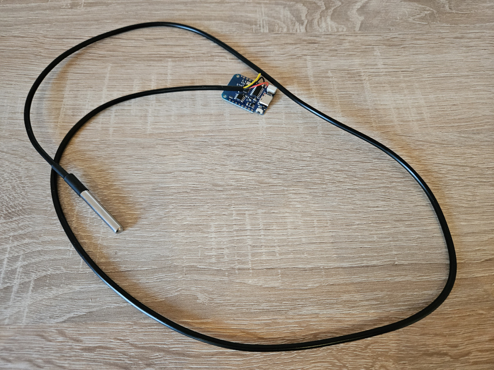

# CXT Heatmap

Der geneigte Besucher der [Convention-X-Treme](https://convention-x-treme) LAN-Party in Karlsdorf-Neuthard weiß, dass es vor Ort gerne mal heiß her geht.

Um zu analysieren wie sich die Temperaturen über das LAN-Party-Wochenende entwickeln, wurde dieses Projekt geboren. Es besteht insgesamt aus drei Repositories:

- [cxt-heatmap](https://github.com/osiris86/cxt-heatmap)
- [cxt-heatmap-fe](https://github.com/osiris86/cxt-heatmap-fe)
- cxt-heatmap-sensor (dieses Repository)
- [cxt-heatmap-data](https://github.com/osiris86/cxt-heatmap-data)

## CXT Heatmap Sensor

Als Sensor wird bei diesem Projekt ein ESP8266 eingesetzt, an welchen ein DS18B20 One-Wire Temperatursensor angelötet ist.

Alle 5 Minuten misst der ESP die aktuelle Temperatur und sendet sie über das WLAN per MQTT. Jeder Sensor hat dabei eine eindeutige ID, die beim Sender der Temperatur ebenfalls übergeben wird.
